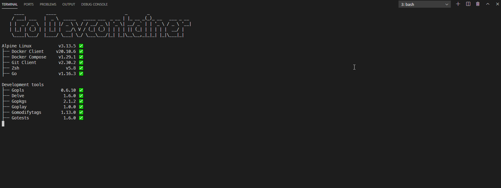

# Go Devcontainer

A Go development container that help you keeping everything up to date.



## Usage

### Prerequisites

You need :
- Visual Studio Code ([download](https://code.visualstudio.com/)) with the [Remote - Containers extension](https://marketplace.visualstudio.com/items?itemName=ms-vscode-remote.remote-containers) installed.
- Docker Desktop (Windows, macOS) or Docker CE/EE (Linux)

Details are available on [the official Visual Studio documentation](https://code.visualstudio.com/docs/remote/containers#_getting-started).

### Configure your workspace

Create a file `.devcontainer/devcontainer.json` in the root of your project.

```javascript
// For format details, see https://aka.ms/devcontainer.json. For config options, see the README at:
// https://github.com/microsoft/vscode-dev-containers/tree/v0.166.1/containers/docker-existing-dockerfile
{
	"name": "Go Devcontainer",

    "image": "adrienaury/go-devcontainer:latest",

	// Set *default* container specific settings.json values on container create.
	"settings": { 
		"terminal.integrated.shell.linux": "/bin/zsh"
	},

	// Add the IDs of extensions you want installed when the container is created.
	"extensions": ["golang.go"],

	// Uncomment the next line to run commands after the container is created.
	// "postCreateCommand": "git config --local core.hooksPath githooks",

	// Uncomment when using a ptrace-based debugger like C++, Go, and Rust
	"runArgs": [ "--init", "--cap-add=SYS_PTRACE", "--security-opt", "seccomp=unconfined" ],

	// Uncomment to use the Docker CLI from inside the container. See https://aka.ms/vscode-remote/samples/docker-from-docker.
	"mounts": [ "source=/var/run/docker.sock,target=/var/run/docker.sock,type=bind" ],

	// Uncomment to connect as a non-root user if you've added one. See https://aka.ms/vscode-remote/containers/non-root.
	"remoteUser": "vscode"
}
```

Then use `F1` key or `Ctrl+Shift+P` and use the `Remote-Containers: Rebuild and Reopen in Container` option.

## Contributing

Pull requests are welcome. For major changes, please open an issue first to discuss what you would like to change.

## License

[MIT](https://choosealicense.com/licenses/mit/)
